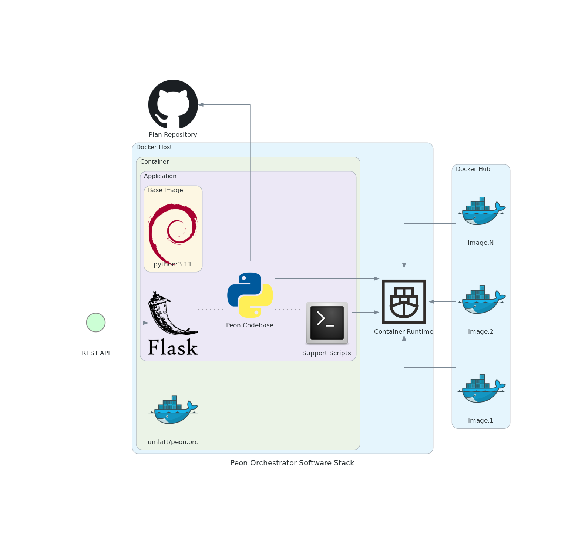

# Orchestrator

The Orc (orchestrator) module is the heart of the project.

It is what manages the process of game server deployment for users.

---

## Design Objectives

- Extremely lightweight.
- [REST API managed](../guides/02_rest_api.md)
- Deploys/controls the game containers.
- Abstracted from the game server/container platform to allow stack evolution.

---

## Software Stack Diagram

*\*This may change as technologies & skills evolve.*



---

### API

RESTful API

Authorization - ``Api-Key``

API-KEY ``my-super-secret-api-key``
> Hard coded as user control is not yet implemented

This API expects a JSON payload in most cases.

[API Docs](http://api.peon.noxnoctua.com/)

```yaml
url: {{peon_orchestrator_url}}:{{api_port}}/api/1.0/
    servers:
        - [GET] List all servers registered to Orchestrator
        - [POST] Create a new game server on Orchestrator
        
    server/get/GAME_UID.SERVERNAME:
        - [GET] Get details of a game server
    server/stats/GAME_UID.SERVERNAME:
        - [GET] Get details of a game server, with performance statistics
    server/start/GAME_UID.SERVERNAME:
        - [PUT] Start a specific game server from the Orchestrator
    server/stop/GAME_UID.SERVERNAME:
        - [PUT] Stop a specific game server from the Orchestrator
    server/restart/GAME_UID.SERVERNAME:
        - [PUT] Restart a specific game server from the Orchestrator
    server/description/GAME_UID.SERVERNAME:
        - [PUT] Update the description of a specific game server from the Orchestrator
    server/destroy/GAME_UID.SERVERNAME:
        - [DEL] Removes a game container leaving the server and config files intact (optional flag to delete all files as well)
        body: { "eradicate" : "True" } *Optional (destructive data removal)
    server/eradicate/GAME_UID.SERVERNAME:
        - [DEL] Deletes all game data & config files
        body: { "eradicate" : "True" } *Required
```

#### Examples

##### Create server

###### e.g. Valhiem Server

URL [REST] - ``POST``

```url
http://orchestrator.domain:5000/api/1.0/servers [POST]
```

HEADERS

```json
{ "X-Api-Key" : "my-super-secret-api-key" }
```

Payload [BODY] - ``JSON``

```json
{
    "game_uid": "valhiem",
    "servername": "server01",
    "description": "A valhiem PEON server",
    "settings": [{
            "type": "env",
            "name": "container environment",
            "content": {
                "SERVERNAME": "My-Valhiem-Server",
                "WORLDNAME": "awesomeworld",
                "PASSWORD": "password123"
            }
        }
    ]
}
```

## Dev Notes

[HTML Response Codes](https://www.restapitutorial.com/httpstatuscodes.html)

---

## Navigation

Links to various project-related resources.

[](https://github.com/the-peon-project/peon-orc)
[](https://github.com/the-peon-project/peon-orc/issues/new/choose)
[](../development/release_notes/01_orchestrator.md)
[](https://hub.docker.com/repository/docker/umlatt/peon.orc/general)

---

## Roadmap

Here are some planned features

### *1.1.x*

- [ ] RESTapi (v1) - Console
- [ ] Security - Users & Audit Loggin
- [ ] Backups

### 1.0.x

- [ ] :zap: RELEASE :zap:
- [ ] Update to new deployment architecture.

### *0.3.x*

- [x] RESTapi (v1) - Plan/recipies
- [x] Security - api-key integration
- [x] Start/Stop scheduler
  
### *0.2.x*

- [x] RESTapi (v1) - custom configurations
- [x] Server deployment (v2) - custom configurations
- [x] Persistent server data - Keep server data for updates & future releases.

### *0.1.x*

- [x] RESTapi (v1)
- [x] Server deployment (v1)

---

## Release Notes

- [ ] CHANGE :tools: Change to svn download for directory (plans)

### 0.3.2

- [x] ADDED :new: Added `/app/bin` to the path and added `peon` cli module into orc.
- [x] CHANGE :tools: Make API key configurable

### 0.3.1

- [x] CHANGE :tools: Rework Orchestrator app to leverage the `docker.sock`
- [x] CHANGE :tools: Moving to init script `init/peon.orc`, for pre-flight checks.
- [x] REMOVED :scissors: Removed SSH check on boot from `python3 main.py`
- [x] ADDED :new: Configurable docker socket path.
- [x] ADDED :new: Added `VERSION` environment variable into the container.

### 0.3.0

- [x] CHANGE :tools: Change dockerfile to support using `docker.sock` socket file to manage docker (from SSH)

### 0.2.17

- [x] BUGFIX :beetle: Remove schedule on manual stop
- [x] CHANGE :tools: Validate epoch time input for scheduler epoch time

### 0.2.16

- [x] BUGFIX :beetle: Server create returned false error due to change error dict handler

### 0.2.15

- [x] BUGFIX :beetle: Scheduler vs Start/Stop

### 0.2.14

- [x] BUGFIX :beetle: Scheduler v1.0 - Bugfix (server stop is now properly scheduled)

### 0.2.13

- [x] ADDED :new: Scheduler - v1.0 - Added simple start & delayed stop in scheduler

### 0.2.12

- [x] CHANGE :tools: API Response - Server config

### 0.2.11

- [x] ADDED :new: PUBLIC_IP - added to container variables

### 0.2.10

- [x] Logging - Added devMode switch

### 0.2.9

- [x] ADDED :new: UI - Added MOTD to container login

### 0.2.8

- [x] CHANGE :tools:  Base images were pulled to get the latest versions & app was rebuilt on those
- [x] BUGFIX :beetle: Incorrect parameter reference in server create

### 0.2.7

- [x] SECURITY :unlock: Inital CORS implementation
- [x] SECURITY :unlock: Initial api-key requirement implementation

### 0.2.6

- [x] ADDED :new: API - Server - Destroy & Eradicate

### 0.2.5

- [x] ADDED :new: API - Server - Reworked to include actions into the path
- [x] ADDED :new: API - Server - Added get with metrics

### 0.2.4

- [x] ADDED :new: API - Server Get - reworked to provide both container & server state

### 0.2.3

- [x] ADDED :new: API - Auto download latest plan version when the server is deployed

### 0.2.2

- [x] ADDED :new: API - Plans get list & update from Peon project list

### 0.2.1

- [x] BUGFIX :beetle: Enforced description & settings on [post]servers

### 0.2.0

- [x] ADDED :new: Added custom config handler
- [x] CHANGE :tools: Allows configuration of environment variables in the container (via API)
- [x] ADDED :new: Can supply json/txt files via API
- [x] ADDED :new: Added persistent description

### 0.1.6

- [x] ADDED :new: Added handler for `config` folder
- [x] ADDED :new: Moved game server logs into the game server directory

### 0.1.5

- [x] INITIALISED :airplane: The first iteration of server create (API)
