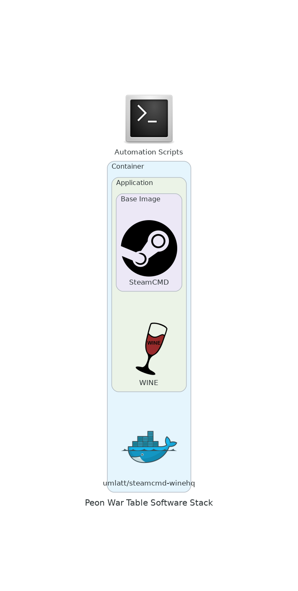

# War Table

The **War Table** module works in conjunction with the Orchestrator to provide the relevant tools for the game containers.

This project handles the tools that are shared between game containers.

## Projects

[*Contained Steam*](https://github.com/the-peon-project/peon-wartable/tree/master/containers/steamcmd) (steamcmd) are scripts to automate/update `steamcmd` and the game server files (within a steamcmd based docker container), as part of the PEON automation services.

[*Steamed Wine*](https://github.com/the-peon-project/peon-wartable/tree/master/containers/steamcmd-wine) (steamcmd+winhq) is a custom container to facilitate game servers that are only built for windows OS, within the PEON toolsuite.

---

## Design Objectives

1. Only scripts/code to be store here. Large file pulls should be done from other sources.
2. Attempt to keep the code pool as generic as possible to maximize code re-use/supportability.
3. If something already exists and is open source don't rewrite needlessly.

---

## Software Stack Diagram

*\*This may change as technologies & skills evolve.*

---

## Navigation

Links to various project-related resources.

---

## Roadmap

Here you can see what the future holds.

---

## Release Notes

### Contained Steam

**SteamCMD**

#### 1.1.0

**:zap: IMPACT RELEASE :zap:**

- [x] CHANGED :tools: reworked the entire deployment flow for better permissions and deeper PEON integration
- [x] CHANGED :tools: PEON specific files now live in `/home/steam/peon` and do not need multiple volume mounts.
- [x] ADDED :new: A container env var that links (if exists) the relevant save data to the `/home/steam/peon/download` directory.

#### 1.0.6

- [x] CHANGED :tools: Set init scripts to run as root. Only the `server_start` script is run as `steam` user.
- [x] ADDED :new: Login banner

#### 1.0.5

- [x] CHANGED :tools: Set default server save path to `/home/steam/data` to match most recipies.

#### 1.0.3

- [x] ADDED :new: Made `server_start` script generic (interpreter directive such as #!/bin/bash = bash script, etc.)
- [x] CHANGED :tools: Reworked the naming to allow for generic container use.

#### 1.0.2

- [x] ADDED :new: Init scripts to ensure the server is updated to latest build on boot.

#### 1.0.0

- [x] INITIALISED :airplane: Initial commit

---

### Steamed Wine

**SteamCMD+WINEHQ**

#### 1.0.1

- [ ] ADDED :new: Add init scripts to mirror changes to PEON

#### 1.0.0

- [x] ADDED :new: WINE deployed
- [x] TESTED :pencil: WINE with VRising server.
- [x] INITIALISED :airplane: Initial commit
