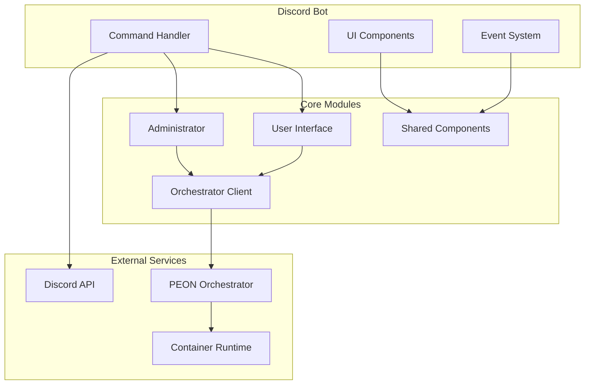

# Discord Bot Development

The Discord Bot module provides an intuitive Discord interface for the PEON platform using modern Discord.py v2 features.

> **✅ STABLE RELEASE (v3.0.0)**

---

## 🎯 Design Objectives

- **User-Friendly**: Non-programmer accessible interface
- **Modern**: Discord.py v2 with slash commands
- **Intuitive**: Smart auto-completion and context awareness
- **Responsive**: Fast, reliable server management
- **Safe**: Confirmation dialogs for destructive actions

---

## 🏗️ Software Stack


**Core Technologies:**
- **Discord.py v2.0+**: Modern Discord API wrapper
- **Python 3.11+**: Async/await patterns
- **Docker**: Containerized deployment
- **REST API**: Communicates with PEON Orchestrator

**Key Libraries:**
- `discord.py` - Discord API interaction
- `requests` - HTTP API communication  
- `asyncio` - Asynchronous operations
- `logging` - Comprehensive error tracking

---

## 🚀 Features

### ✅ Completed

- **Modern Slash Commands**: Full Discord.py v2 implementation
- **Interactive UI**: Buttons, modals, dropdowns, persistent views
- **Auto-Completion**: Smart suggestions for all commands
- **Server Management**: Start, stop, restart, update, backup operations
- **Administrator Interface**: Orchestrator management, server creation
- **Enhanced Error Handling**: Clear, actionable error messages
- **Safety Features**: Confirmation dialogs for destructive actions
- **Legacy Support**: Graceful migration from prefix commands
- **Debug Tools**: Connection testing and diagnostics
- **Resource Optimization**: Efficient API usage and caching

### 🔄 In Progress

- **Advanced Scheduling**: Recurring server operations
- **User Permission System**: Role-based access control
- **Webhook Integration**: External service notifications
- **Custom Embeds**: Personalized server status displays

### 📋 Roadmap

- **Multi-Language Support**: Internationalization
- **Advanced Analytics**: Server usage statistics  
- **Plugin System**: Extensible functionality
- **Voice Channel Integration**: Voice-activated commands

---

## 📊 Architecture Overview



### Component Details

**Command Handler (`main.py`)**:
- Slash command registration and routing
- Auto-completion providers
- Error handling and logging
- Legacy command migration

**Administrator Module (`administrator.py`)**:
- Orchestrator registration/management
- Server creation workflows
- System monitoring and diagnostics
- Advanced configuration options

**User Interface Module (`user.py`)**:
- Server-specific controls
- Interactive button panels
- Modal forms for input
- Confirmation dialogs

**Orchestrator Client (`orchestrator.py`)**:
- REST API communication
- Response parsing and error handling
- Connection pooling and retry logic
- API key management

**Shared Components (`shared.py`)**:
- Common UI builders
- Utility functions
- Configuration management
- Interaction cleanup

---

## 🔧 Development Setup

### Local Development

```bash
# Clone repository
git clone https://github.com/the-peon-project/peon-bot-discord.git
cd peon-bot-discord

# Setup Python environment
python -m venv venv
source venv/bin/activate  # Linux/Mac
venv\Scripts\activate     # Windows

# Install dependencies
pip install -r requirements.txt

# Configure environment
cp .env.example .env
nano .env  # Add your Discord token and settings

# Run development server
python app/main.py
```

### Docker Development

```bash
# Build development image
docker build -t peon-bot-dev .

# Run with live reload
docker run -d \
  --name peon-bot-dev \
  -e DISCORD_TOKEN=your_token \
  -e LOCAL_API_KEY=your_key \
  -v $(pwd)/app:/app \
  peon-bot-dev
```

### Testing Discord Bot

1. **Create Discord Application**:
   - Go to [Discord Developer Portal](https://discord.com/developers/applications)
   - Create new application
   - Add bot with required permissions

2. **Set up Test Server**:
   - Create Discord server for testing
   - Invite bot with admin permissions
   - Create test channels for different scenarios

3. **Test Command Flow**:
   ```
   /peon admin          # Test admin interface
   /create minecraft test  # Test server creation
   /server start        # Test server management
   /debug test_connectivity  # Test diagnostics
   ```

---

## 📝 API Integration

### Orchestrator Communication

The bot communicates with PEON Orchestrator via REST API:

```python
# Example API call structure
def server_create(url, api_key, game_uid, warcamp_name, user_settings={}):
    server_uid = f"{game_uid}.{warcamp_name}"
    endpoint_url = f"{url}/api/v1/server/create/{server_uid}"
    headers = {'Accept': 'application/json', 'X-Api-Key': api_key}
    body = {"game_uid": game_uid, "warcamp": warcamp_name, **user_settings}
    
    response = requests.put(endpoint_url, headers=headers, json=body)
    response.raise_for_status()
    return {"status": "success", "data": response.json()}
```

### Error Handling Patterns

```python
# Comprehensive error handling
try:
    result = orchestrator_api_call()
    if result['status'] == 'success':
        # Handle success
        embed = build_success_embed(result['data'])
    else:
        # Handle API-level errors
        embed = build_error_embed(result['message'])
except requests.exceptions.RequestException as e:
    # Handle network/HTTP errors
    embed = build_error_embed(f"Connection failed: {str(e)}")
except Exception as e:
    # Handle unexpected errors
    logging.error(f"Unexpected error: {e}")
    embed = build_error_embed("An unexpected error occurred")
```

---

## 🎨 User Interface Design

### Modern Discord Components

**Slash Commands**:
```python
@bot.tree.command(name="create", description="🏗️ Create a new game server")
@app_commands.describe(
    game_type="Type of game server to create",
    server_name="Name for the new server"
)
@app_commands.autocomplete(game_type=game_type_autocomplete)
async def create_server(interaction, game_type: str, server_name: str):
    # Implementation
```

**Interactive Buttons**:
```python
@discord.ui.button(label="🚀 Start", style=discord.ButtonStyle.success)
async def server_start(self, interaction, button):
    # Handle server start with visual feedback
```

**Auto-completion**:
```python
async def server_autocomplete(interaction: discord.Interaction, current: str):
    servers = get_user_servers()
    return [
        app_commands.Choice(name=server['name'], value=server['uid'])
        for server in servers if current.lower() in server['name'].lower()
    ][:25]  # Discord limit
```

### Enhanced Visual Feedback

- **Status Emojis**: 🟢 Running, 🔴 Stopped, 🟡 Starting
- **Action Icons**: 🚀 Start, 🛑 Stop, 🔄 Restart, ⬆️ Update
- **Risk Indicators**: ⚠️ Medium Risk, 🚨 High Risk, ✅ Safe
- **Progress Indicators**: Loading states and confirmation messages

---

## 🔐 Security Considerations

### API Key Management

```python
# Secure API key handling
API_KEY = os.environ.get('LOCAL_API_KEY')
if not API_KEY:
    logging.critical("API key not configured")
    sys.exit(1)

# Per-request header injection
headers = {'Accept': 'application/json', 'X-Api-Key': API_KEY}
```

### Input Validation

```python
# Server name validation
if not re.match(r'^[a-zA-Z0-9._-]+$', server_name):
    return await interaction.followup.send(
        embed=build_error_embed("Invalid server name format")
    )

# Command parameter sanitization
game_type = game_type.lower().strip()
server_name = server_name.lower().replace(' ', '_')
```

### Permission Checking

```python
# Discord permission verification
if not interaction.channel.permissions_for(interaction.user).administrator:
    return await interaction.followup.send(
        embed=build_error_embed("Administrator permissions required"),
        ephemeral=True
    )
```

---

## 📊 Performance Optimization

### Async Best Practices

```python
# Efficient async operations
async def batch_server_status():
    tasks = []
    for server in servers:
        task = asyncio.create_task(get_server_status(server))
        tasks.append(task)
    
    results = await asyncio.gather(*tasks, return_exceptions=True)
    return process_results(results)
```

### Caching Strategy

```python
# Response caching for frequently accessed data
from functools import lru_cache
from datetime import datetime, timedelta

@lru_cache(maxsize=100)
def get_cached_plans(timestamp):
    # Cache plans for 5 minutes
    return fetch_plans_from_api()

def get_plans():
    now = datetime.now()
    timestamp = int(now.timestamp() // 300) * 300  # 5-minute intervals
    return get_cached_plans(timestamp)
```

### Rate Limit Handling

```python
# Discord API rate limiting
from discord.ext import tasks

@tasks.loop(seconds=1)
async def process_queue():
    if command_queue and not rate_limited:
        command = command_queue.pop(0)
        await execute_command(command)
```

---

## 📋 Release Notes

### **v3.0.0** - Modern Discord Interface

**🎉 MAJOR RELEASE - Complete Modernization**

#### ✨ New Features
- **Slash Commands**: Complete migration from prefix commands
- **Enhanced UI**: Buttons, modals, dropdowns, and persistent views
- **Auto-Completion**: Smart suggestions for all command parameters
- **Interactive Management**: Point-and-click server administration
- **Safety Features**: Confirmation dialogs for destructive operations
- **Debug Tools**: Built-in diagnostics and troubleshooting
- **Legacy Migration**: Graceful transition from old command format

#### 🛠️ Technical Improvements
- **Discord.py v2**: Modern async/await patterns
- **Performance**: Optimized API usage and response times
- **Error Handling**: Comprehensive error messages and recovery
- **Logging**: Enhanced debugging and monitoring capabilities
- **Code Quality**: Complete rewrite with modern best practices

#### 🐛 Bug Fixes
- Fixed interaction timeout issues
- Resolved message cleanup problems  
- Corrected permission checking logic
- Improved API error handling
- Fixed auto-completion edge cases

### **v2.0.0** - Enhanced Bot Behavior

**⚡ IMPACT RELEASE**

- ✅ **Server Deployment**: Create servers directly from Discord
- ✅ **Orchestrator Management**: Register/deregister orchestrators  
- ✅ **Granular Updates**: Server/image/full/reinit update modes
- ✅ **Import System**: Discover and import existing servers
- ✅ **Enhanced UI**: Card-based responses with rich formatting
- ✅ **Admin Controls**: Channel-based permission system
- ✅ **Version Info**: Dynamic version reporting from components

### **v1.2.x** - Stability and Features

- ✅ **API Key Management**: Dynamic API key updates
- ✅ **Container Info**: Version and type reporting
- ✅ **Port Management**: Usage tracking and assignment
- ✅ **Plan System**: Dynamic game plan fetching
- ✅ **Timer Improvements**: Enhanced scheduling system
- ✅ **Error Handling**: Better error messages and recovery

### **v1.0.x** - Foundation

- ✅ **Core Functionality**: Basic server control (start/stop/restart)
- ✅ **Multi-Server**: Support for multiple game servers
- ✅ **Timer System**: Scheduled server operations
- ✅ **Discord Integration**: Message-based interface

---

## 🔗 Development Resources

### Documentation
- **[Discord.py Documentation](https://discordpy.readthedocs.io/)**
- **[Discord Developer Portal](https://discord.com/developers/docs)**
- **[Discord Bot Best Practices](https://discord.com/developers/docs/topics/community-resources)**

### Related Components
- **[PEON Orchestrator](01_orchestrator.md)** - API backend
- **[Container Runtime](02_wartable.md)** - Game server execution
- **[Game Plans](03_warplans.md)** - Server templates

### Project Links
- **[GitHub Repository](https://github.com/the-peon-project/peon-bot-discord)**
- **[Docker Hub](https://hub.docker.com/repository/docker/umlatt/peon.bot.discord)**
- **[Issue Tracker](https://github.com/the-peon-project/peon-bot-discord/issues)**
- **[Discord Community](https://discord.gg/KJFVyayH8g)**

**1.2.6**

- [x] CHANGE :tools: Built on the latest python/package codebase

**1.2.5**

- [x] CHANGE :tools: Updated to latest OS/package combinations.

**1.2.4**

- [x] TYPO :beetle: Fixed a bad response example in `!usage` command

**1.2.3**

- [x] ADDED :new: Usage response

**1.2.2**

- [x] ADDED :new: Update game server command.

**1.2.1**

- [x] BUGFIX :beetle: Fixed an issue with the regex matching for a minute interval (would match any possible string)

**1.2.0**

**:zap: IMPACT RELEASE :zap:**

- [x] CHANGED :tools: Added language localization. Completely re-wrote messaging language module.
- [x] CHANGED :tools: Moved localization files to `/app/reference/`
- [x] CHANGED :tools: Moved from `/api/1.0` to `/api/v1`
- [x] ADDED :new: Get a list of available game plans

**1.1.0**

**:zap: IMPACT RELEASE :zap:**

- [x] CHANGED :tools: Moved logging into container logs
- [x] ADDED :new: Added `DEV_MODE` flag to enable/disable logging/dev mode.

**1.0.1**

- [x] BUGFIX :beetle: Auto append minute time unit to request, if no time unit is provided.

**1.0.0**

- [x] CHANGED :tools: Improved data response legibility on get.
- [x] CHANGED :tools: Updated bot to handle changes to the Orc API (since Orc release v1.0.1)
- [x] REMOVED :scissors: Removed `dev_mode` switch

**:zap: IMPACT RELEASE :zap:**

**0.2.8**

- [x] CHANGED :tools: Messaging - Reworked error messages
- [x] BUGFIX :beetle: Scheduling past event times.

**0.2.7**

- [x] ADDED :new: Added shutdown scheduler

**0.2.6**

- [x] CHANGED :tools: Better natural language support

**0.2.5**

- [x] ADDED :new: Added aliases for commands

**0.2.2**

- [x] CHANGED :tools: Reformatted info in the message feed
- [x] ADDED :new: Server_Config - Allowed for json formatted content

**0.2.1**

- [x] ADDED :new: Discord - Added message cleaner ``clear [int]``

**0.2.0**

- [x] ADDED :new: Orc - control start/stop/restart

**0.1.1**

- [x] ADDED :new: Added devMode switch

**0.1.0**

- [x] ADDED :new: First version of the bot
- [x] ADDED :new: Basic get-all/get the functionality
- [x] SECURITY :unlock: Hardcoded bot key

**0.0.0**

- [x] INITIALISED :airplane: Initial commit
