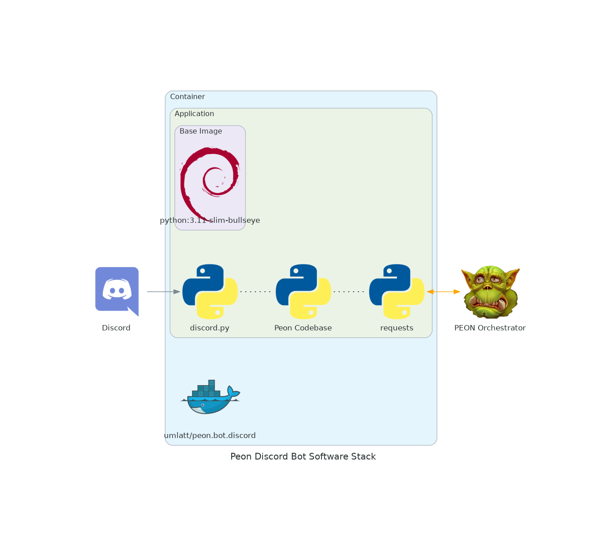

# Bot.Discord

The Web UI module is a supplemental service to the PEON project.

This is a Discord bot to manage orchestrators.

> **RELEASED**

---

## Design Objectives

- Non-programmer friendly

---

## Software Stack Diagram

---

## Dev Notes

- [How to: guide](https://realpython.com/how-to-make-a-discord-bot-python/)
- [Discord Application](https://discord.com/developers/applications)
- [Discord.py](https://discordpy.readthedocs.io/en/stable/ext/commands/api.html#bots)

### Improved bots

[interactions.py](https://discord-interactions.readthedocs.io/en/latest/quickstart.html)

---

## Navigation

Links to various project-related resources.

---

## Features

- [x] :tools: All basic server control functionality (start, stop, restart...)
- [x] :tools: API calls respond with builder/based on cards (embeds)

---

## Roadmap

- [ ] CHANGED :tools: Bot is re-written for ``slash`` commands (see ``interactions.py``)

---

## Release Notes

**:zap: IMPACT RELEASE :zap:**

- [ ] BUGFIX :beetle: Serves with same/different game are overwriting each other
- [ ] ADDED :new: Deploy server from discord
- [ ] ADDED :new: Get version number from Orc (API required)
- [ ] ADDED :new: Always send a `stop date time` message in response
- [ ] ADDED :new: `!refresh` To trigger updates the plans on the orcs

- [x] ADDED :new: Get specific plan details.
- [x] ADDED :new: Get a list of available plans.
- [x] ADDED :new: An `!about` bot directive with version details and links.
- [x] ADDED :new: VERSION environment variable
- [x] CHANGED :tools :Fail on `!stop *` if invalid timevalue provided
- [x] CHANGED :tools: Removed internal `settings.json` in favour of environment variables.
- [x] CHANGED :tools: Reworked the MOTD
- [x] CHANGED :tools: Completed admin/user flow
- [x] CHANGED :tools: Reworked entire server filtering flow
- [x] BUGFIX :beetle: Fixed an issue where the control channel wasn't being informed when the bot connected.
- [x] BUGFIX :beetle: Fixed an issue where the plans were not being collected from the orchestrator correctly.
- [x] BUGFIX: :beetle: Fixed an issue with the `!getall` command

**1.2.7**

- [x] BUGFIX :beetle: Fixed an issue where the local orc's API key would not be updated in the config file.

**1.2.6**

- [x] CHANGE :tools: Built on the latest python/package codebase

**1.2.5**

- [x] CHANGE :tools: Updated to latest OS/package combinations.

**1.2.4**

- [x] TYPO :beetle: Fixed a bad response example in `!usage` command

**1.2.3**

- [x] ADDED :new: Usage response

**1.2.2**

- [x] ADDED :new: Update game server command.

**1.2.1**

- [x] BUGFIX :beetle: Fixed an issue with the regex matching for a minute interval (would match any possible string)

**1.2.0**

**:zap: IMPACT RELEASE :zap:**

- [x] CHANGED :tools: Added language localization. Completely re-wrote messaging language module.
- [x] CHANGED :tools: Moved localization files to `/app/reference/`
- [x] CHANGED :tools: Moved from `/api/1.0` to `/api/v1`
- [x] ADDED :new: Get a list of available game plans

**1.1.0**

**:zap: IMPACT RELEASE :zap:**

- [x] CHANGED :tools: Moved logging into container logs
- [x] ADDED :new: Added `DEV_MODE` flag to enable/disable logging/dev mode.

**1.0.1**

- [x] BUGFIX :beetle: Auto append minute time unit to request, if no time unit is provided.

**1.0.0**

- [x] CHANGED :tools: Improved data response legibility on get.
- [x] CHANGED :tools: Updated bot to handle changes to the Orc API (since Orc release v1.0.1)
- [x] REMOVED :scissors: Removed `dev_mode` switch

**:zap: IMPACT RELEASE :zap:**

**0.2.8**

- [x] CHANGED :tools: Messaging - Reworked error messages
- [x] BUGFIX :beetle: Scheduling past event times.

**0.2.7**

- [x] ADDED :new: Added shutdown scheduler

**0.2.6**

- [x] CHANGED :tools: Better natural language support

**0.2.5**

- [x] ADDED :new: Added aliases for commands

**0.2.2**

- [x] CHANGED :tools: Reformatted info in the message feed
- [x] ADDED :new: Server_Config - Allowed for json formatted content

**0.2.1**

- [x] ADDED :new: Discord - Added message cleaner ``clear [int]``

**0.2.0**

- [x] ADDED :new: Orc - control start/stop/restart

**0.1.1**

- [x] ADDED :new: Added devMode switch

**0.1.0**

- [x] ADDED :new: First version of the bot
- [x] ADDED :new: Basic get-all/get the functionality
- [x] SECURITY :unlock: Hardcoded bot key

**0.0.0**

- [x] INITIALISED :airplane: Initial commit
