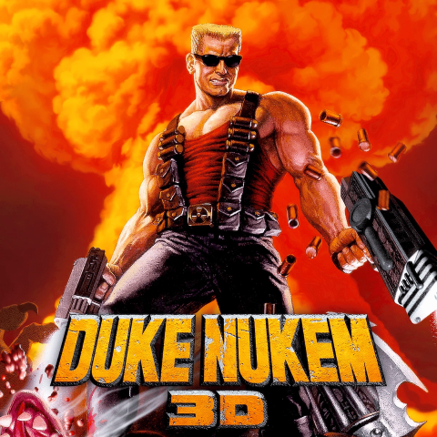

# Duke Nukem 3D (EDuke32)

The PEON war plan that Peon uses to deploy your game server.

## Official Documentation

[EDuke32 Wiki](https://wiki.eduke32.com/wiki/Main_Page)

## Code Repo

- [GitHub Project](https://github.com/the-peon-project/peon-warplans/tree/main/dukenukem)

## Technical Details

- **Container Image**: `umlatt/steamcmd`
- **Steam App ID**: `434050`
- **Default Port**: `23513/udp`
- **Mode**: `steamcmd`
- **Requires**: Legal copy of `DUKE3D.GRP` game data

## Features

- [ ] *None requested*

---

- [x] RELEASED :zap: Plan is available for use.
- [x] INITIALISED :airplane: Initial build.

## Credits

This war plan was contributed by [dman1901](https://github.com/dman1901).
