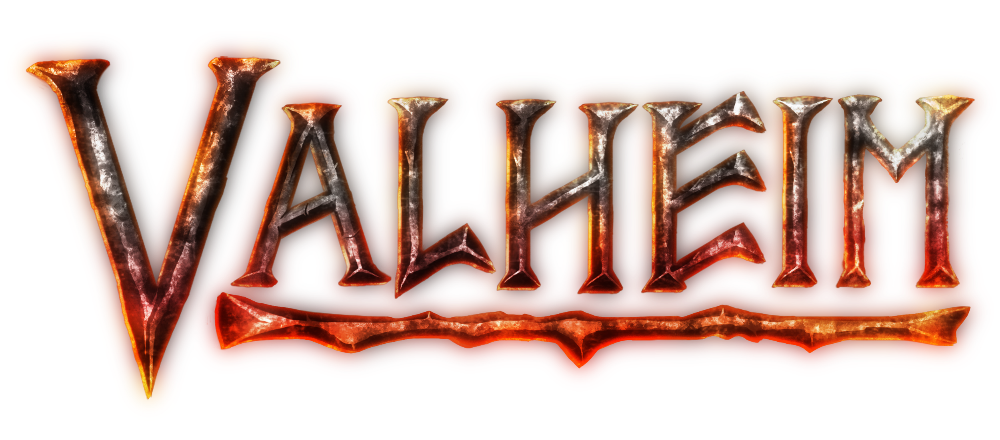

# Valheim

The PEON war plan that Peon uses to deploy your game server.

## Official Documentation

[Source Guide](https://valheim.fandom.com/wiki/Valheim_Dedicated_Server#Manual_Setup)

## Code Repo

- [GitHub Project](https://github.com/the-peon-project/peon-warplans/tree/main/valheim)

## Features

- [ ] *None requested*

---

- [x] RELEASED :zap: Plan is available for use.
- [x] CHANGED :tools: Reworked with `steamcmd` release to confirm better deployment standard.
- [x] INITIALISED :airplane: Initial build.
