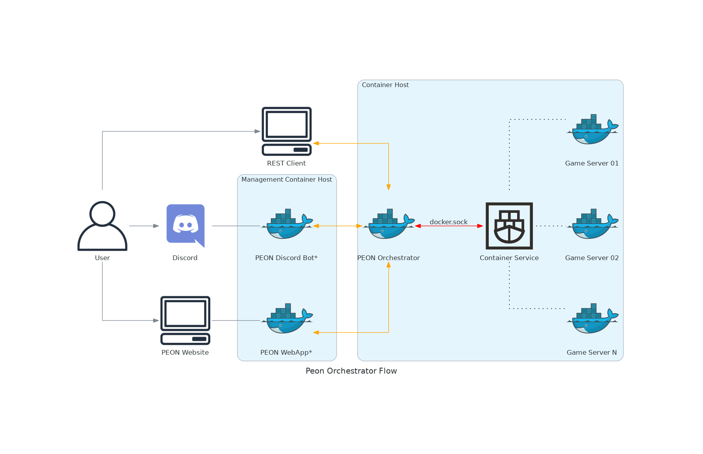

# 🛠️ Developer Documentation

Complete development guide for contributing to and extending the PEON project.

!!! info "Developer Community"
    Join our [Discord development channel](https://discord.com/invite/KJFVyayH8g) for real-time collaboration and support!

## 🚀 Quick Start for Developers

### Development Environment Setup

1. **Clone the repository**
   ```bash
   git clone https://github.com/the-peon-project/peon.git
   cd peon
   ```

2. **Install dependencies**
   ```bash
   # Docker and Docker Compose required
   sudo apt-get install docker.io docker-compose git
   
   # Add user to docker group
   sudo usermod -aG docker $USER
   ```

3. **Start development environment**
   ```bash
   # Deploy PEON stack
   ./deploy_peon.sh
   
   # Verify installation
   docker ps
   ```

4. **Access development tools**
   - **Orchestrator API**: `http://localhost:5000`
   - **Web UI**: `http://localhost:3000`  
   - **Documentation**: `http://localhost:8000`

### First Contribution

1. **[Architecture Overview](00_peon.md)** - Understand the system design
2. **[Local Development](01_orchestrator.md)** - Set up your environment  
3. **[API Development](../api/index.md)** - Work with the REST API
4. **[Discord Bot](50_bot_discord.md)** - Extend Discord functionality
5. **[Game Integration](../guides/games/index.md)** - Add new game support

## 📐 System Architecture

PEON uses a modular microservices architecture designed for scalability and maintainability.



### Core Components

| Component | Purpose | Technology |
|-----------|---------|------------|
| **[Orchestrator](01_orchestrator.md)** | Core API and server management | Python, FastAPI |
| **[Discord Bot](50_bot_discord.md)** | User interface and notifications | Python, Discord.py v2 |
| **[Web UI](04_webui.md)** | Browser-based management console | Python, Flask |
| **[War Table](02_wartable.md)** | Shared services and infrastructure | Docker, Docker Compose |
| **[War Plans](../guides/games/index.md)** | Game server configurations | JSON, Shell scripts |

### Communication Flow

- **🟠 REST API** - HTTP/JSON communication between components
- **🔴 Docker Socket** - Container management and monitoring  
- **🟢 Discord Gateway** - Real-time Discord integration
- **🔵 WebSocket** - Live updates in web interface

## 🏗️ Development Guides

### Backend Development

#### Core Services
- **[Orchestrator Development](01_orchestrator.md)** - Main API service
- **[War Table Services](02_wartable.md)** - Shared infrastructure
- **[Authentication & Security](../api/index.md)** - API security implementation

#### Integration Development  
- **[Discord Bot Extensions](50_bot_discord.md)** - Add new Discord commands
- **[Web UI Features](04_webui.md)** - Browser interface development
- **[Webhook System](../api/index.md#webhooks)** - External service integration

### Frontend Development

#### User Interfaces
- **[Discord Bot UI](50_bot_discord.md)** - Slash commands and interactions
- **[Web Dashboard](04_webui.md)** - Browser-based management
- **[API Documentation](../api/index.md)** - Developer-facing docs

#### Game Integration
- **[War Plan Creation](../guides/games/index.md)** - New game server recipes  
- **[Container Images](02_wartable.md)** - Custom game containers
- **[Configuration Schemas](../api/index.md#game-catalog)** - Game-specific settings

## 🔧 Development Tools

### Code Quality
```bash
# Python linting and formatting
pip install black flake8 mypy
black . --check
flake8 .
mypy .

# JavaScript/TypeScript (Web UI)
npm install eslint prettier
npm run lint
npm run format
```

### Testing Framework
```bash
# Unit tests
python -m pytest tests/

# Integration tests  
python -m pytest tests/integration/

# End-to-end tests
python -m pytest tests/e2e/
```

### Debugging Tools
```bash
# Enable debug mode
export PEON_DEBUG=true

# View logs
docker logs peon-orchestrator
docker logs peon-discord-bot

# Interactive debugging
python -m pdb app/main.py
```

## 📚 Code Standards

### Python Style Guide
- **PEP 8** compliance with 88-character line limit
- **Type hints** required for all public functions
- **Docstrings** following Google style
- **Error handling** with custom exception classes

```python
from typing import List, Optional
import logging

logger = logging.getLogger(__name__)

class ServerNotFoundError(Exception):
    """Raised when specified server cannot be found."""
    pass

async def get_server(server_id: str) -> Optional[GameServer]:
    """Retrieve server by ID.
    
    Args:
        server_id: Unique server identifier
        
    Returns:
        GameServer instance or None if not found
        
    Raises:
        ServerNotFoundError: If server doesn't exist
    """
    try:
        return await db.get_server(server_id)
    except KeyError:
        logger.error(f"Server not found: {server_id}")
        raise ServerNotFoundError(f"Server {server_id} not found")
```

### Git Workflow
```bash
# Feature development
git checkout -b feature/discord-slash-commands
git add .
git commit -m "feat: add server management slash commands"
git push origin feature/discord-slash-commands

# Create pull request via GitHub
# Automated testing runs on PR creation
```

### Commit Message Format
```
type(scope): brief description

[optional body]

[optional footer]
```

**Types:** `feat`, `fix`, `docs`, `style`, `refactor`, `test`, `chore`  
**Scopes:** `api`, `discord`, `webui`, `docs`, `tests`

## 🎮 Game Development

### Adding New Games

1. **Research requirements**
   - Server software and dependencies
   - Configuration options and defaults
   - Network ports and protocols
   - Resource requirements

2. **Create war plan**
   ```bash
   cd peon-warplans
   mkdir my-game
   cp template/plan.json my-game/
   # Edit configuration
   ```

3. **Test deployment**
   ```bash
   # Local testing
   ./deploy_peon.sh
   
   # Create test server via API
   curl -X POST localhost:5000/api/v1/servers \
     -H "Content-Type: application/json" \
     -d '{"name":"test","game":"my-game"}'
   ```

4. **Submit for review**
   ```bash
   git add peon-warplans/my-game/
   git commit -m "feat: add support for My Game"
   git push origin feature/my-game-support
   ```

### Container Development
Custom game containers for complex deployments:

```dockerfile
# Example game server container
FROM ubuntu:20.04

# Install game server
RUN apt-get update && apt-get install -y \
    game-server-package \
    && rm -rf /var/lib/apt/lists/*

# Configure server
COPY config/ /opt/gameserver/config/
COPY entrypoint.sh /entrypoint.sh

EXPOSE 7777/udp
ENTRYPOINT ["/entrypoint.sh"]
```

## 🧪 Testing Strategy

### Unit Testing
```python
import pytest
from app.services import GameServerService

@pytest.fixture
def server_service():
    return GameServerService()

@pytest.mark.asyncio
async def test_create_server(server_service):
    """Test server creation with valid parameters."""
    server = await server_service.create_server(
        name="test-server",
        game="valheim"
    )
    
    assert server.name == "test-server"
    assert server.game == "valheim"
    assert server.status == "creating"
```

### Integration Testing
```python
import httpx
import pytest

@pytest.mark.integration
async def test_api_server_lifecycle():
    """Test complete server creation, start, stop cycle."""
    async with httpx.AsyncClient(base_url="http://localhost:5000") as client:
        # Create server
        response = await client.post("/api/v1/servers", json={
            "name": "integration-test",
            "game": "valheim"
        })
        assert response.status_code == 201
        server_id = response.json()["id"]
        
        # Start server
        response = await client.post(f"/api/v1/servers/{server_id}/start")
        assert response.status_code == 200
        
        # Stop server
        response = await client.post(f"/api/v1/servers/{server_id}/stop")
        assert response.status_code == 200
```

## 📖 Reference Materials

### Terms & Definitions

| Term | Definition |
|------|------------|
| **Orchestrator** | Core API service managing game servers |
| **War Table** | Shared infrastructure and container services |
| **War Plan** | Game server configuration and deployment recipe |
| **Web UI** | Browser-based management interface |
| **War Camp** | Docker host running PEON services |
| **War Chief** | Multi-cluster management component |

### Development Symbols

Used throughout changelogs and documentation:

| Symbol | Meaning | Usage |
|--------|---------|-------|
| :zap: | **Impact Release** | Breaking changes across multiple components |
| :airplane: | **Project Init** | New project or major component added |
| :new: | **Feature Added** | New functionality implemented |
| :bug: | **Bug Fixed** | Issue resolved |
| :books: | **Documentation** | Docs updated or improved |
| :art: | **Code Quality** | Refactoring, performance, or style improvements |

### API Versioning

| Version | Status | Features | End of Life |
|---------|--------|----------|-------------|
| **v1.0** | Stable | Basic server management | Active |
| **v1.1** | Beta | Advanced monitoring | 2024 Q2 |  
| **v2.0** | Planning | Multi-cluster support | 2024 Q3 |

## 🤝 Contributing

### Development Process

1. **Join the community** - [Discord development channel](https://discord.com/invite/KJFVyayH8g)
2. **Pick an issue** - Check [GitHub Issues](https://github.com/the-peon-project/peon/issues)
3. **Set up environment** - Follow [development setup](#development-environment-setup)
4. **Create feature branch** - Use descriptive branch names
5. **Write tests** - Maintain high code coverage  
6. **Submit PR** - Include detailed description and testing notes
7. **Code review** - Collaborate with maintainers
8. **Deploy and celebrate** 🎉

### Contribution Types

| Type | Examples | Getting Started |
|------|----------|-----------------|
| **Bug Fixes** | Fix API errors, UI issues | [Good First Issues](https://github.com/the-peon-project/peon/issues?q=is%3Aissue+is%3Aopen+label%3A%22good+first+issue%22) |
| **New Games** | Add game server support | [War Plan Guide](../guides/games/index.md) |
| **Features** | Discord commands, API endpoints | [Feature Requests](https://github.com/the-peon-project/peon/issues?q=is%3Aissue+is%3Aopen+label%3Aenhancement) |
| **Documentation** | Guides, API docs, tutorials | [Doc Issues](https://github.com/the-peon-project/peon/issues?q=is%3Aissue+is%3Aopen+label%3Adocumentation) |

### Recognition

Active contributors receive:
- **GitHub contributor badge**  
- **Discord contributor role**
- **Special thanks in releases**
- **Priority support** for their projects

## 🆘 Development Support

### Getting Help
- **[Discord #dev-support](https://discord.gg/KJFVyayH8g)** - Real-time help
- **[GitHub Discussions](https://github.com/the-peon-project/peon/discussions)** - Architecture questions
- **[Stack Overflow](https://stackoverflow.com/questions/tagged/peon)** - Code-specific questions

### Useful Resources  
- **[Development Wiki](https://github.com/the-peon-project/peon/wiki)** - Additional guides
- **[API Reference](../api/index.md)** - Complete API documentation  
- **[Discord.py Documentation](https://discordpy.readthedocs.io/)** - Discord bot framework
- **[Docker Documentation](https://docs.docker.com/)** - Container development

---

Ready to contribute? **[Set up your development environment →](#development-environment-setup)**
| CHANGED | :tools: `:tools:` | When a modification to the existing codebase/architecture has been carried out |
| OPTIMISED | :alarm_clock: `:alarm_clock:` | When a portion of the codebase has been improved visually or with regards to performance |
| REMOVED | :scissors: `:scissors:` | When something is removed/cut from the codebase |
| BUGFIX | :beetle: `:beetle:` | When a bug has been identified and resolved |
| LOGGING| :speech_balloon: `:speech_balloon:` | When logging is added/enhanced/improved |
| TESTED | :pencil: `:pencil:` | When a test task is planned & executed |
| SECURITY | :unlock: `:unlock:` | When some security modifications have been added |
| BLOCKED | :no_entry_sign: `:no_entry_sign:` | When something is stuck due to external requirements |

---

## Tools & Technologies

Below, is a list of the various tools and technologies leveraged in the development process for the PEON project.

### ASCII Text Art Style

Things like the `motd` file will use the ascii text art style `Delta Corps Priest 1`. A nice alternative (non-ansi) is `Elite`

### Documentation

#### Material for MkDocs

[Project Link](https://squidfunk.github.io/mkdocs-material/)

We are using `mkdocs-material` as the basis for our documentation framework, as it is markdown compliant and requires minimal maintenance to provide aesthetically pleasing documentation.

##### Logo/Symbol Search

If you need to find a logo/symbol that exists in the `mkdocs-material` platform a useful link is [here](https://squidfunk.github.io/mkdocs-material/reference/icons-emojis/)

---

### Diagram Design

#### Python Diagrams

[Project Link](https://diagrams.mingrammer.com/docs/getting-started/examples)

We are using the *diagrams* module for Python. It offers the ability to dynamically generate diagrams programmatically. *There is a built-in (Material for MkDocs) programmatic diagram software, however, initial investigations did not appear to provide as aesthetic a design as Python Diagrams*
