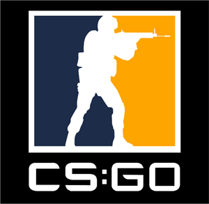

# Counter Strike : Global Offensive



## Before you start

### Game Server Login Token

If you wish to run this server outside of your private network (required by Steam for any servers running outside of your home LAN), you will need to get a game server login token.

[Registering Game Server Login Token](./index.md#login-tokenappidgslt)

## Manually Configuring Settings

You can go to the official docs to see what you can change. Just replace the config files with what you want and restart the server.

[Offical Guide](https://developer.valvesoftware.com/wiki/Counter-Strike:_Global_Offensive/Dedicated_Servers#Advanced_Configuration)

All of these files can be found and edited in the server's local storage path.

`./peon/servers/[game_uid]/[server_name]/`

## Stand-alone mode

How to deploy a server without the PEON project.

*This is built around container tech, so you will need something like Docker installed.*

1. Go to the [gihub project](https://github.com/the-peon-project/peon-warplans/tree/main/csgo)
2. Download the files `docker-compose.yml`, `.env.example` & `server_start` from the project repo.
3. Put the files into a folder together.
4. Make the folders `status` and `server_files` and set all file permissions to that of your container user id (1000)
```bash
mkdir status server_files
chown -R 1000:1000 .
```
5. Make sure that the `server_start` file has exceute permissions
```bash
chmod u+x server_start
```
6. Copy `.env.example` to `.env` and edit the contents where necessary (e.g. updating the GSLT)
7. Start the server and play.
```bash
# newer systems
docker compose up -d
# older systems
docker-compose up -d 
```

> Or... just use PEON. it should do all the heavy lifting for you.

## Links

If you want to dig a bit deeper, here are the links

- [Development Docs](../../development/games/csgo.md)
- [Github Project](https://github.com/the-peon-project/peon-warplans/tree/main/csgo)
