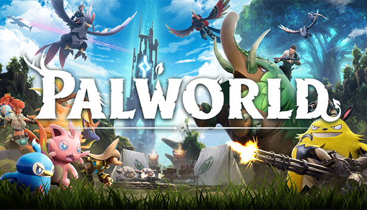

# Palworld

## Before you start

### World Saves

Your world saves will be stored in the path `./user` if you use the provided `docker-compose.yml`.
You can find the Server Config in the Config subfolder and your saved game in the SaveGames subfolder.
This will allow you to download/backup/move files around at your leisure.

All of these files can be found and edited in the server's local storage path.

`./peon/servers/[game_uid]/[server_name]/`

## Stand-alone mode

[Guide on GitHub](https://github.com/the-peon-project/peon-warplans/tree/main/palworld#Guide)

> Or... just use PEON. it should do all the heavy lifting for you.

## Links

If you want to dig a bit deeper, here are the links

- [Development Docs](../../development/games/palworld.md)
- [GitHub Project](https://github.com/the-peon-project/peon-warplans/tree/main/palworld)
