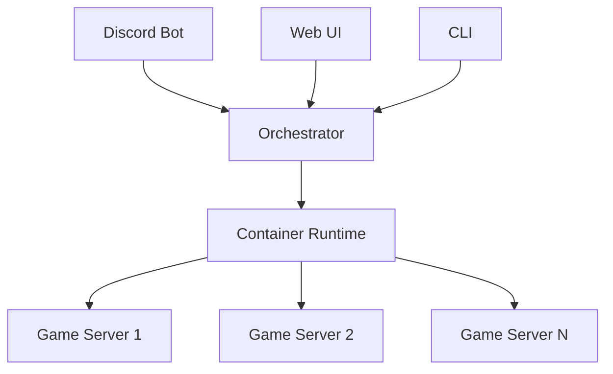

# Quick Start Guide

Welcome to PEON! This guide will help you get your first game server running in minutes.

## What is PEON?

PEON is a **Game Server as a Service (GSaaS)** platform that makes hosting game servers simple. Whether you're running Minecraft, Valheim, Palworld, or any other supported game, PEON handles the complexity for you.

### 🎯 Key Benefits

- **Easy Setup**: Deploy servers with a few clicks
- **Discord Integration**: Manage servers directly from Discord
- **Multi-Game Support**: 20+ supported games and growing
- **Resource Efficient**: Optimized container-based architecture
- **Cross-Platform**: Works on Linux, Windows, and macOS

## Architecture Overview

- **Discord Bot**: Modern slash-command interface for server management
- **Orchestrator**: Core API that manages all game servers
- **Container Runtime**: Secure, isolated environment for each game
- **Web UI**: Browser-based management interface
- **CLI**: Command-line tools for advanced users

## Next Steps

Choose your installation method:

- **[🚀 Quick Install](installation.md)** - Docker Compose (recommended)
- **[🎮 First Server](first-server.md)** - Deploy your first game server